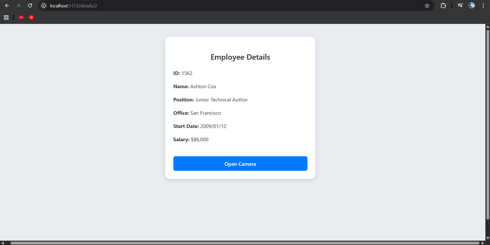
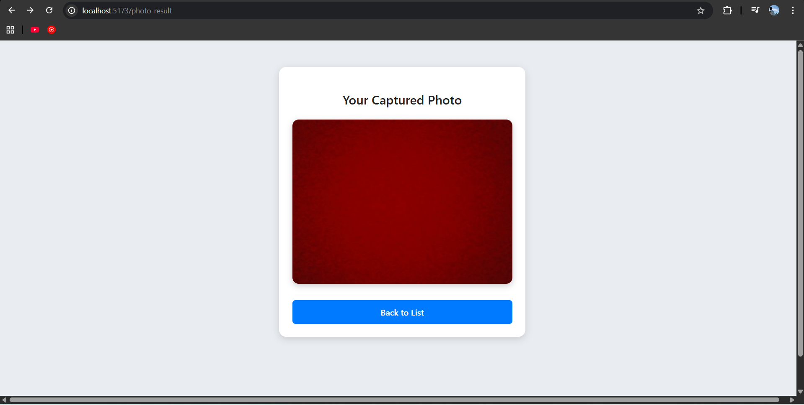
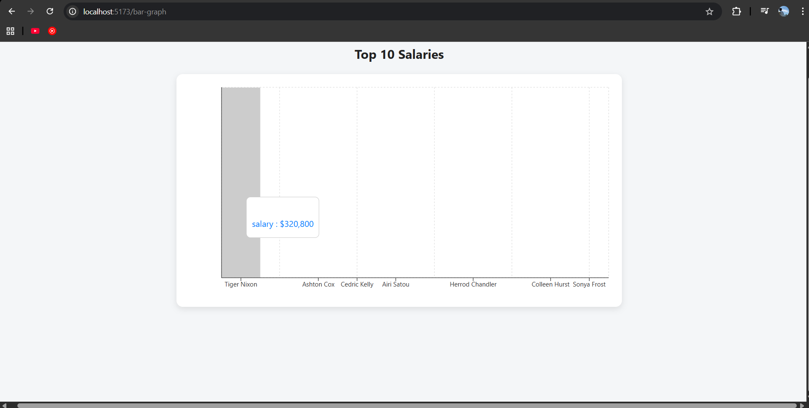
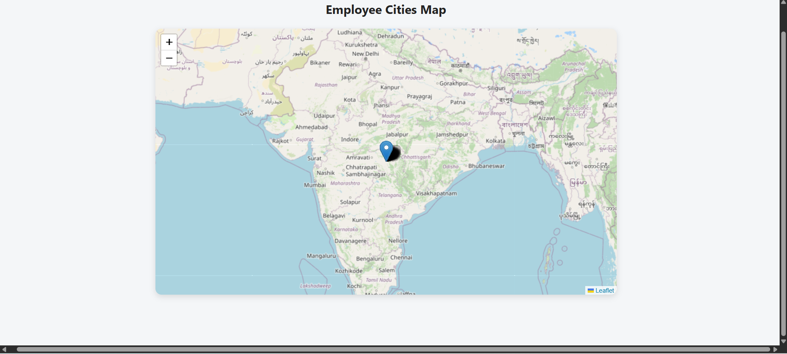

# Employee Dashboard

This project is a complete **4‑screen React application** built using **Vite**, featuring:

* Login Page
* Employee List Page (Fetched via API)
* Employee Details Page with Webcam Capture
* Photo Result Page
* Bar Graph Page (Top 10 Salaries)
* Map Page (Employee Locations)

---

##  Tech Stack

* **React + Vite**
* **Recharts** (Bar Graph)
* **Leaflet + React‑Leaflet** (Map)
* **Axios** (API Calls)
* **Webcam.js** (Camera Capture)
* Modern UI with clean design

---

##  Application Screenshots

###  Login Page

)

---

###  Employee List Page


---

###  Employee Details Page



---

###  Webcam Photo Result Page



---

###  Salary Bar Graph Page



---

###  Employee Cities Map Page



---

##  Installation

```bash
yarn install
yarn dev
```

OR

```bash
npm install
npm run dev
```

---

##  Login Credentials

For frontend login:

```
username: testuser
password: Test123
```

For backend API auth:

```
username: test
password: 123456
```

---

##  API Used

```
POST https://backend.jotish.in/backend_dev/gettabledata.php
```

Payload:

```json
{
  "username": "test",
  "password": "123456"
}
```

---

##  Project Structure

```
src/
 ├── pages/
 │    ├── LoginPage.jsx
 │    ├── ListPage.jsx
 │    ├── DetailsPage.jsx
 │    ├── PhotoResultPage.jsx
 │    ├── BarGraphPage.jsx
 │    └── MapPage.jsx
 ├── api.js
 └── main.jsx
```

---

##  Features

* Clean UI with modern card layouts
* Fully centered responsive pages
* API‑driven employee list
* Photo capture using webcam
* Graph + Map visualization

---

## 🙌 Author

Harsh Kabra
